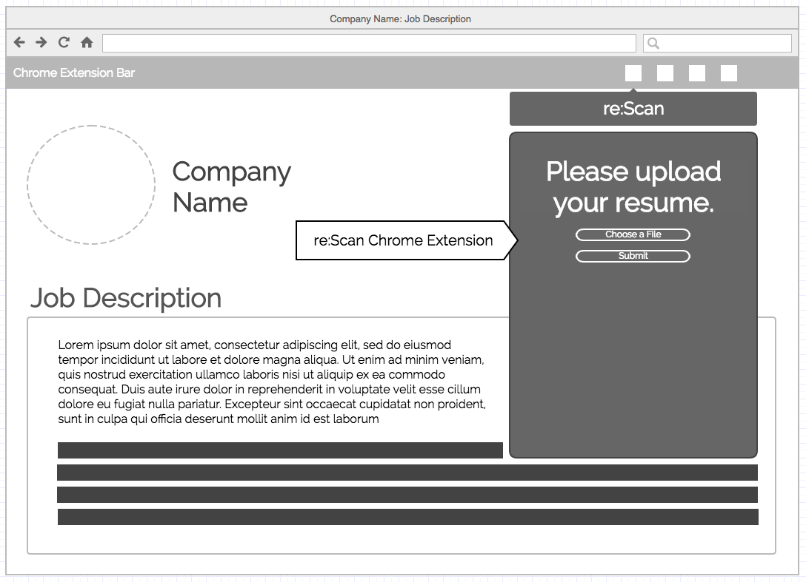
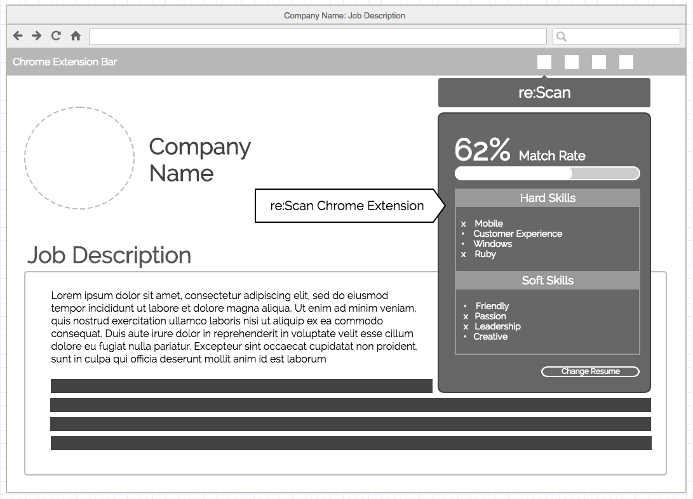

# re:Scan
re:Scan (Resume Scanner) is a Chrome extension that provides a detailed report on how well-tailored an applicant's resume is to a particular job description.

## Background
A well-tailored resume is an essential aspect to a successful job application. However, crafting such a resume can be difficult and time-consuming.

re:Scan seeks to simplify the resume tailoring process by providing instant feed back on resume and job description similarity. It parses through a job description to isolate specific hard and soft qualities an employer is looking for. It then parses through an applicant's resumes looking for key words that suggest an applicant possesses these qualities. A percentage score that reflects how well a resume is suited for a job description is consequently produced. If an applicant's resume highly reflects the qualities an employer is looking for, a high percentage score is given. Otherwise, a low percentage score along with suggested verbs is provided.

Applicants should be able to upload their resume to the extension. This resume should persist through browser navigation and be easily accessed upon clicking the Chrome extension button. The extension will parse through the DOM to look for job description text.

### Functionality & MVP

With this extension, users will be able to:

- [ ] Upload and parse a copy of their resume
- [ ] Parse a job application page for keywords
- [ ] Obtain a similarity percentage between the uploaded resume and the job application

### Wireframes
re:Scan will appear as a modal when its corresponding Chrome extension icon is clicked in the Chrome extension bar.

If the user has not uploaded a resume yet, the user will be prompted to upload his/her resume. The resume will be parsed immediately with its details stored within the extension itself.

If the user has already uploaded a resume, the extension will proceed to automatically parse the job description on the current webpage. The parsed resume information will be compared with the parsed job description information and a percentage score will be produced along with a comparison of keywords that are either present or missing from the applicant's resume.

### Technologies & Technical Challenges

This extension will be implemented using the standard Chrome extension technology: Javascript, HTML, and CSS.  In addition to the `manifest.json` and `package.json` files, there will be two scripts:

- `parser.js` which will contain the logic for parsing documents
- `wordmatcher.js`which will contain the logic for term matching and frequency of key words.

The primary technical challenges will be:

- Parsing through both the uploaded resume and the job application page
- Determining weight and frequency of key words
- Matching the frequency of all key words to generate a single percentage

The uploaded resume and job application will be parsed while ignoring stop words. Once both documents parsed, each key word and several synonyms from the job application will be compared against the uploaded resume. The frequency of the keywords located within the job application will be compared with the matching keywords in the resume to result in a singular percentage number to denote similarity.

### Implementation Timeline
**Day 1**: Get started on the infrastructure of the extension, following <a href="https://developer.chrome.com/extensions/getstarted">this guide</a> from Chrome.  By the end of the day, we will have:

- A completed `package.json`
- A completed `manifest.json`
- The ability to upload and store a resume

**Day 2**: Look into parsing mechanisms in order to parse the stored resume and job applications. Additionally, methods of isolating the job application content will be explored. By the end of the day, we will have:

- The ability to parse resume contents
- The ability to parse just the job application contents

**Day 3**: Explore methods of identifying and counting key words. We would likely look into public dictionary/thesaurus APIs to find multiple keyword matches

- Obtain a method to weigh various keywords against the uploaded resume
- Obtain raw matching data between the two documents

**Day 4**: Consolidate matching data, and provide tertiary metrics such as resume length, job title matches, and advanced degrees.

- Provide and display a singular number as a metric for how well the resume matches with the given job application description
- Provide supplemental data to provide additional matching criteria, or where resume can be improved to better fit the job description
