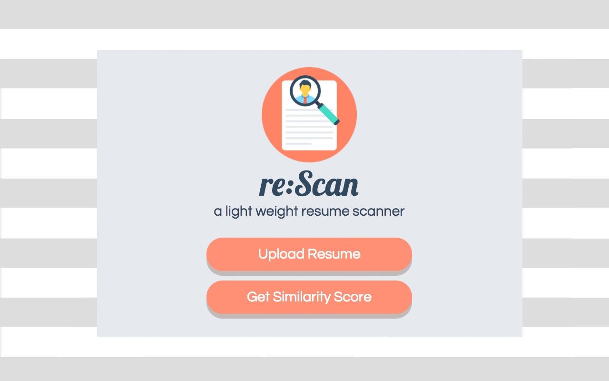
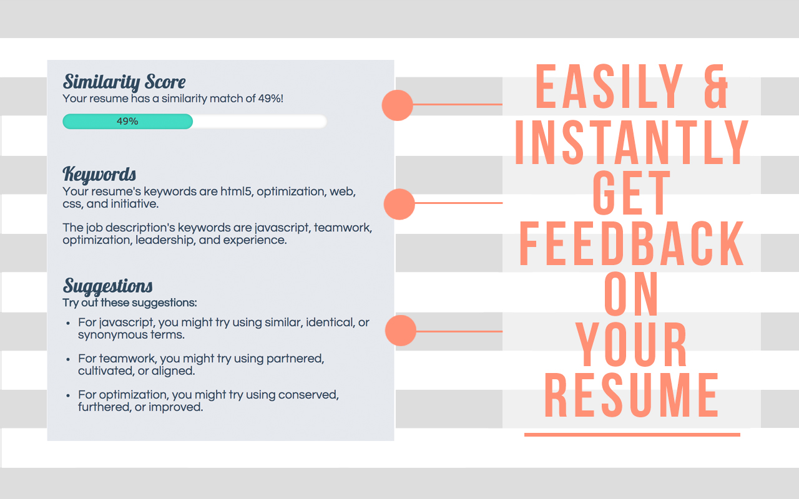
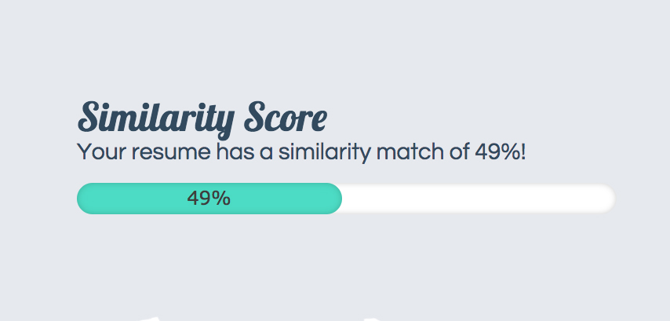
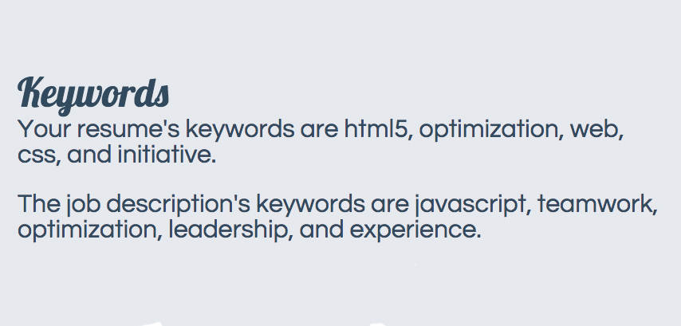
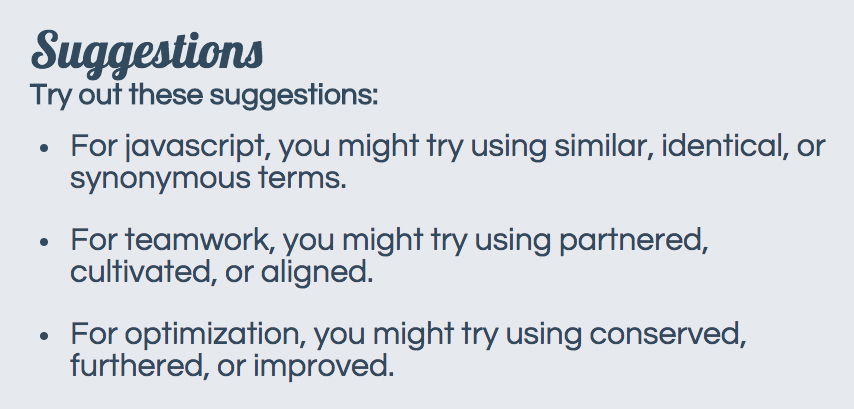

# re:Scan
[Download Link][download-link]
[download-link]: https://chrome.google.com/webstore/detail/rescan/fjiopcojjjafjnfgipombdbpjimignpl?hl=en-US&gl=US

re:Scan is a resume scanner that takes in a resume and parses through it for keywords. It then parses through a web page's job description with the click of a button and provides a general summary that includes a similarity score, keyword comparisons, and suggestions. The parsed resume persists through multiple clicks, so there is no need to upload a new resume every time one wants to compare their resume to a job description. While the extension is geared towards helping job-seekers, it is also useful for recruiters who are curious about an applicant's resume's fit.

## Features & Implementation
### Similarity Score

The Similarity Score gives you a percentage that represents how closely a resume aligns with a job description. It is calculated by parsing through both the resume and job description and removing all stop words before comparing the two documents. Repeated words and words that generally indicate that same quality are considered the same and matched. The more matches there are, the higher the percentage score will be.
### Keywords

The second key feature of re:Scan is that of keywords. Because re:Scan parses through both the submitted resume and the job description, it is able to find the keywords for each separate document. This becomes very helpful in comparing which keywords a job description highlights versus which keywords a resume highlights.

Keywords for each document are calculated in the same way. The application uses a natural language processing algorithm that runs through the parsed resume and job description looking for words that are repeated most often. It then sorts displays the top five repeated words. Some words that point to the same quality are picked up automatically (e.g. 'created', 'engineered', and 'pioneered' all point to the same quality of 'leadership'). This helps users determine which words they should try incorporating.

### Suggestions

The third key feature of re:Scan is that of suggestions. Because the application picks up on certain words that point to general qualities, it is capable of making suggestions. The application compares the keywords of the resume with the keywords of the job description. If any keywords do not match, it will suggest that the user either use the exact words that the job description uses or provide a sample of words that point to a particular quality indicated as a job description's keyword.

## Future Directions
### Suggestions
Right now, it is still very difficult for our application to catch on to every word that indicates a particular kind of quality.

It is fairly simple to construct a library of resume verbs that point to certain quality because most verbs follow widespread libraries and past-tense formats. However, it is very difficult to construct libraries for job descriptions. In fact, it would be extremely inefficient to try and load such a large library of words. An area of in which this application could improve then would be some element of artificial intelligence that can learn which words point to which qualities. That way, the application can produce more helpful suggestions.
